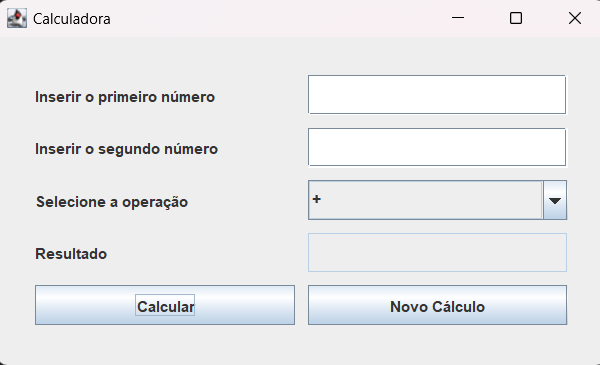

# Calculadora Java

## Tecnologias Utilizadas

    
   

## Descrição

Este projeto é uma calculadora simples desenvolvida em Java, que realiza as quatro operações aritiméticas básicas: adição, subtração, multiplicação, e divisão. A calculadora foi criada
usando a biblioteca Swing para implementar uma interface gráfica, onde me permitiu aprofundar meus conhecimentos em Java, especialmente na criação de interfaces gráficas onde estou tendo meus primeiros contatos 

## Pré-Requisitos

Antes de começar, verifique se você tem os seguintes itens instalados em sua máquina:

1. **Java JDK**
   - Este projeto é desenvolvido em Java, então você precisa ter o Java JDK instalado. Você pode baixá-lo e instalá-lo a partir do [site oficial da Oracle](https://www.oracle.com/java/technologies/javase-jdk11-downloads.html).

2. **IDE**
  - Uma IDE de sua preferência. eu indico:
     - [Eclipse](https://www.eclipse.org/downloads/)
     - [Visual Studio Code](https://code.visualstudio.com/) com a extensão Java para VS Code

3. **Git (opcional)**
   - Para clonar o repositório e gerenciar o versionamento do código. Você pode baixar o Git a partir do [site oficial](https://git-scm.com/).

## Contato

Para perguntas ou mais informações, entre em contato comigo:

- **Email:** alexsandro68silva@gmail.com
- **LinkedIn:** [Meu Perfil no LinkedIn](https://www.linkedin.com/in/alexsandro-silva-228836197/)
